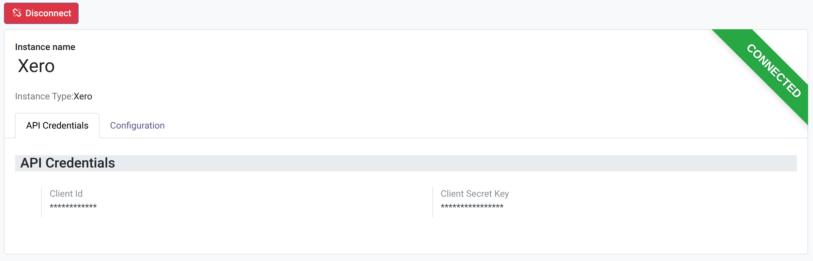
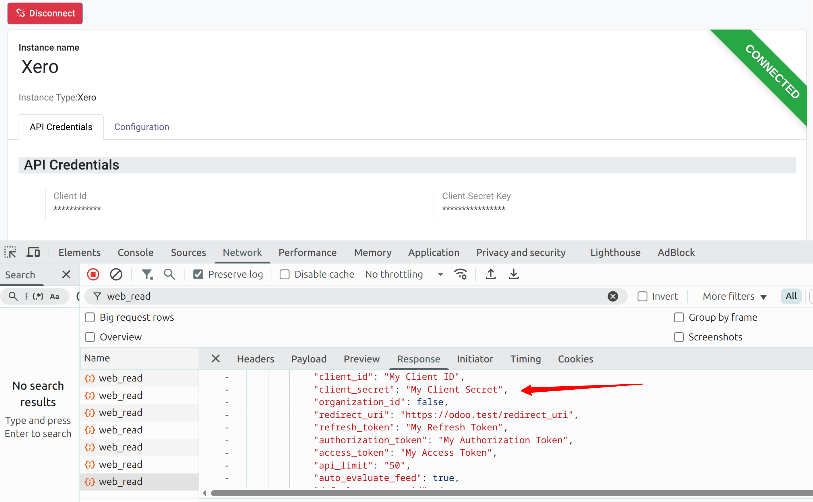

=============
Obscure Field
=============

Add a Char-compatible Odoo field for credentials that must not appear raw in
form view network responses, read APIs, or exports.

This module adds ``fields.Obscure`` for sensitive values such as passwords, API
keys, client secrets, refresh tokens, access tokens, and webhook secrets. The
real value remains available to trusted server-side Python code, while standard
``read``, ``web_read``, and export payloads receive a masked value.

**Table of contents**

.. contents::
   :local:

The Problem
===========

A common implementation mistake is to store credentials such as passwords, API
keys, client secrets, and access tokens in regular character fields, then only
hide them visually in the form view. The value may look protected to the user,
but the browser can still receive the original value behind the scenes.

For example, an integration module might define credential fields as plain
``fields.Char`` values:

::

   from odoo import fields, models

   class Marketplace(models.Model):
       _name = 'marketplace'

       client_id = fields.Char(string='Client ID')
       client_secret = fields.Char(string='Client Secret')
       refresh_token = fields.Char(string='Refresh Token')
       access_token = fields.Char(string='Access Token')

The form view may then apply the password option to mask the value on screen:

::

   <group>
       <field name="client_id"/>
       <field name="client_secret" password="True"/>
       <field name="refresh_token" password="True"/>
       <field name="access_token" password="True"/>
   </group>

Resulting form view with credential fields visually masked.

This is not enough. Inspecting the browser network tab can still reveal the
sensitive values in the response payload, even though the form input displays a
masked value.

Chrome inspector response tab showing sensitive data returned in plain text.

Obscure Field fixes the problem at the field layer. Only fields declared as
``fields.Obscure`` are masked in ``read``, ``web_read``, and export responses.

Key Features
============

* Declare sensitive values with ``fields.Obscure`` instead of regular
  ``fields.Char``.
* Return ``******`` for populated obscure fields in ``read`` and ``web_read``
  payloads.
* Mask exported values to reduce accidental CSV or XLSX credential disclosure.
* Keep the real stored value available to trusted server-side Python code
  through ``record.field``.
* Ignore all-star placeholder writes, so saving a form does not overwrite the
  existing credential.
* Apply masking only to fields explicitly declared as ``fields.Obscure``.

Installation
============

Copy the module into your Odoo addons path, then install it from Apps or with:

::

   ./odoo-bin -d your_database -i obscure_field

Restart Odoo after installation or upgrade so the new field class is registered.

Example Code
============

Declare sensitive fields with ``fields.Obscure``:

::

   from odoo import fields, models

   class Marketplace(models.Model):
       _name = 'marketplace'

       client_secret = fields.Obscure(string='Client Secret')
       refresh_token = fields.Obscure(string='Refresh Token')
       access_token = fields.Obscure(string='API Access Token')

Server-side Python code still reads the real value:

::

   def action_connect(self):
       secret = self.client_secret
       token = self.access_token
       # Use the real values for trusted backend logic.

Odoo read and web_read responses receive a masked value:

::

   {
       "client_secret": "******",
       "refresh_token": "******",
       "access_token": "******"
   }

Behavior
========

``record.client_secret``
   Returns the real value to server-side Python code.

``read`` / ``web_read``
   Returns ``******`` when the field has a value.

Export
   Returns a masked value instead of the stored credential.

``write({'client_secret': '******'})``
   Ignored as an unchanged placeholder.

``write({'client_secret': 'new-secret'})``
   Saves the new value.

Write Behavior
==============

The field treats all-star values as unchanged placeholders:

::

   record.write({'client_secret': '******'})      # ignored, keeps old secret
   record.write({'client_secret': 'new-secret'})  # saves the new value
   record.write({'client_secret': False})         # clears the value

This follows the same practical idea used by many admin configuration screens:
if the user submits the masked placeholder, the stored credential was not
changed.

Example Form View
=================

The ``password`` attribute is still useful for the input widget, but the
important protection is done by ``fields.Obscure`` on the server response.

::

   <record id="marketplace_form_view" model="ir.ui.view">
       <field name="name">marketplace.form</field>
       <field name="model">marketplace</field>
       <field name="arch" type="xml">
           <form>
               <sheet>
                   <group>
                       <field name="client_secret" password="True"/>
                       <field name="refresh_token" password="True"/>
                       <field name="access_token" password="True"/>
                   </group>
               </sheet>
           </form>
       </field>
   </record>

Important Limits
================

* This module currently hides values from read/export payloads.
* This module does not encrypt values at rest yet.
* This module is not a replacement for proper Odoo ACLs, record rules, or
  groups.
* Trusted server-side Python code can still access the real value.
* Existing ``fields.Char`` credentials must be changed to ``fields.Obscure`` to
  get the masking behavior.

Credits
=======

Authors
-------

* tuanhoangdef <hng.atuan@gmail.com>
